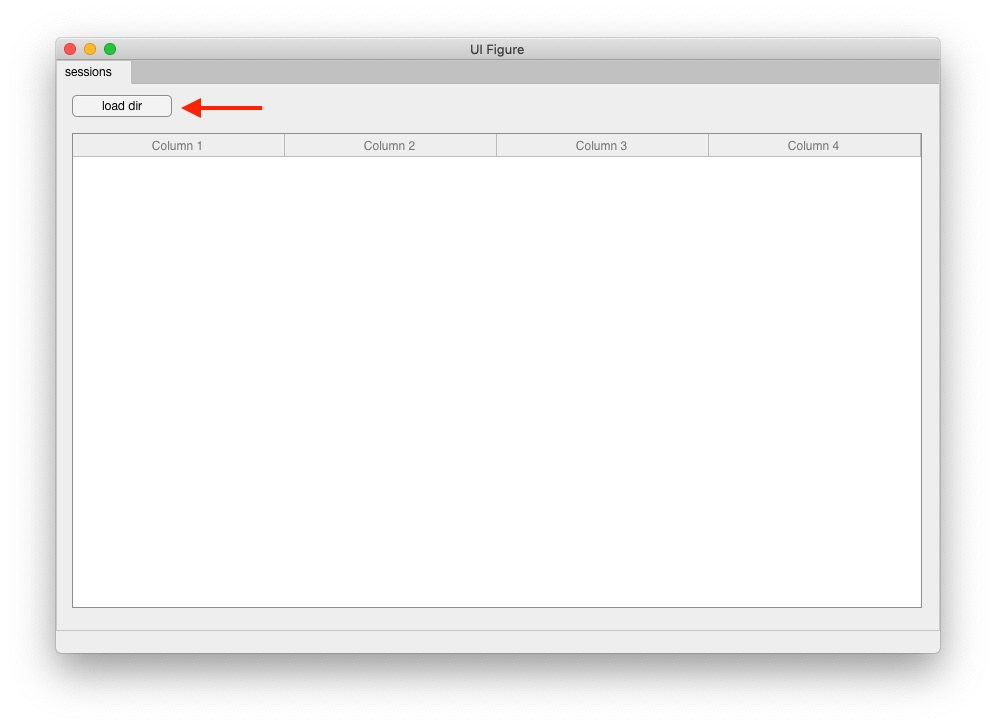
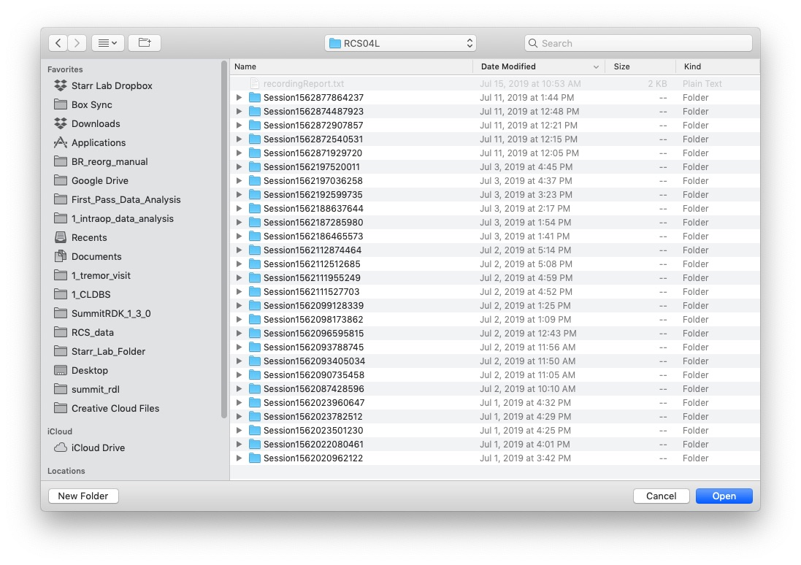
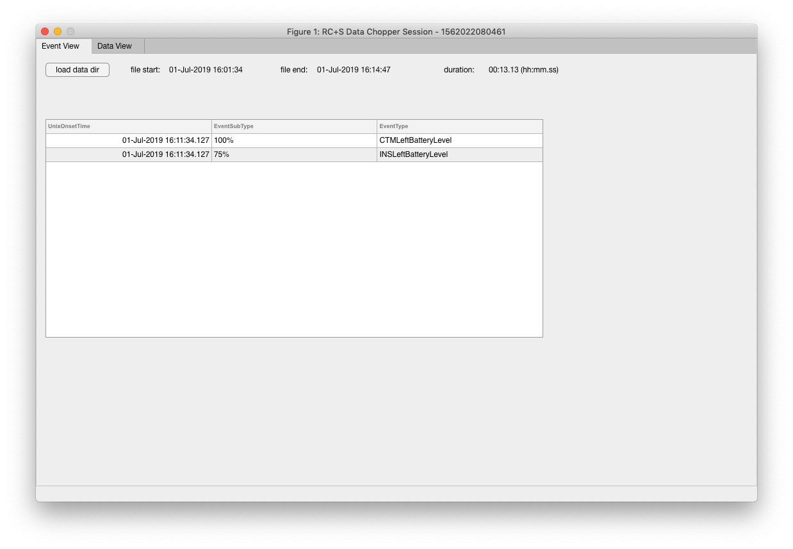
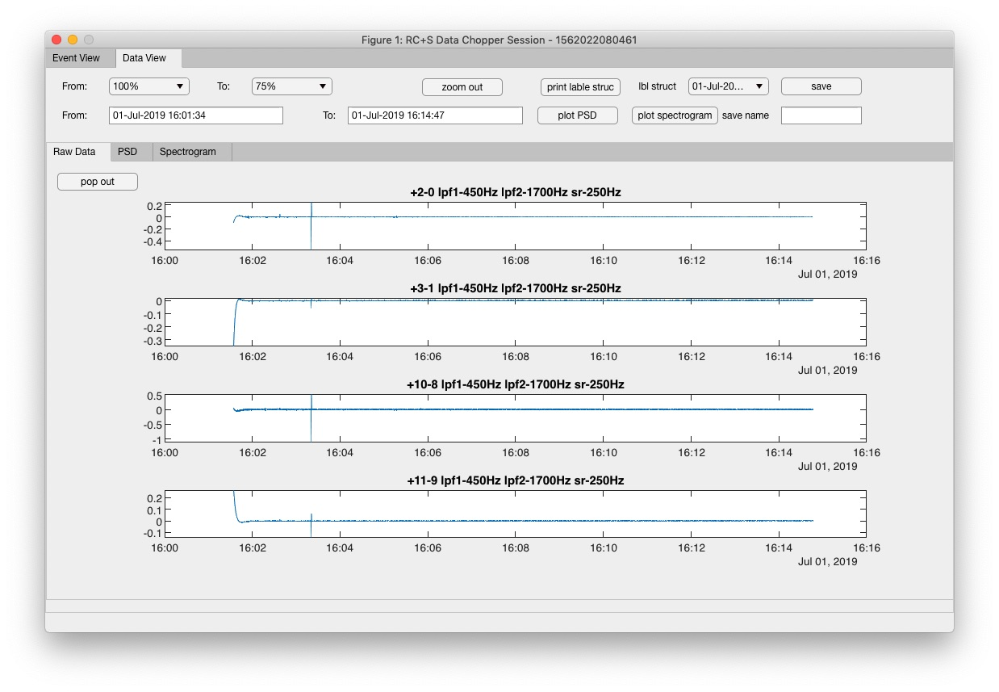
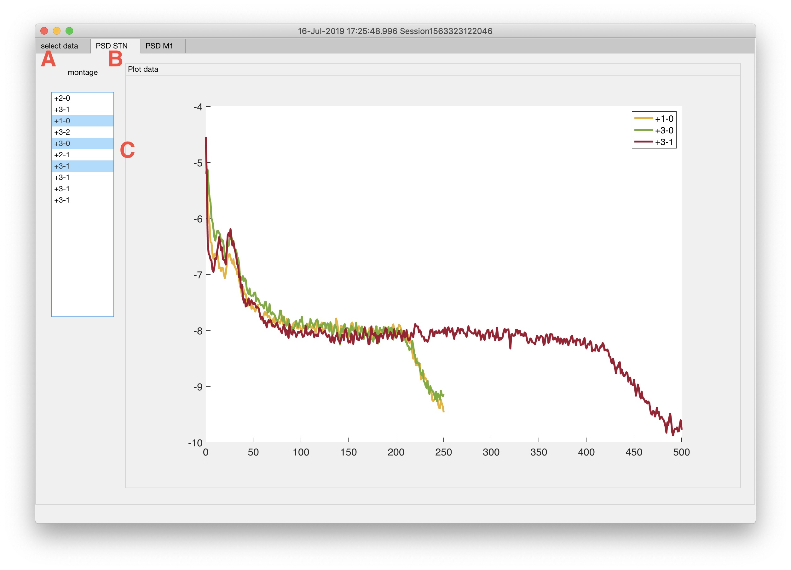

Summit RC+S preprocessing and analysis functions
==

Summary: 
-------------

This collection of code allows the preprocessing analysis and plotting of RC+S data. It includes a collection of GUI tools to plot the data in interactive form as well as command line (Matlab) tools to get at the raw data. It also has some code to allow syncing to Delsys data. 

Tips for data recording 
-------------
Sample data files for recording at home, in clinic and for aDBS are provided in this repo. Below you will find links to sample files that will work with each recording scenario. Here are a few general tips: 

* Check the sensing settings:
	* Mode 3/4: Recording in mode 3 allows reliable transmission at 4500 bps at a larger range, whereas mode 4 allows 6000 bps at a shorter range. At home we usually use mode 3 and in clinic mode 4.  
	* Sampling rate: 2 time domain channels @1000Hz, 4 @500hz.   
	* Recording electrodes: Make sure to check recording electrodes are correct. 
	* Make sure all the channels you want are "enabled". 
	* Check both stream and sense enables are set correctly. Stream enables control what data is actually streamed (recorded) whereas sense enables have to do with what data it is possible to stream. One example: to stream power data you would want to allow FFT for sense (required) but not stream (since it transmits too much data and you will get packet loss). Consult Medtronic manual for more detail on this. 
	* Check that current settings will not create packet loss using excel sheet in the help docs if using settings that are different than the ones supplied below. 

#### Sample config files: 
* [aDBS settings sample file](data/sample_config_files/aDBS_config/adbsConfig.md) - these are sample sense settings for aDBS (embedded) recording using one LD and 1 power channel. 
* [home recording](data/sample_config_files/home_recording/homeRecordingReadme.md) - setting optimized for home recording of data 
* [in clinic recording](data/sample_config_files/in_clinic_recording/InClinicRecordingreadme.md) - setting optimized for in clinic recording of data 
* [montage recording](data/sample_config_files/montage_recording/Montagereadme.md) - sample montage files that we used for most montage settings 
* [stim sweeep](data/sample_config_files/stim_sweep/stimsweepreadme.md) - sample files to be used during a stimulation sweep

	

Installation instructions
-------------

* Download the repository 
* Before every use please run the function `updateandcheckdepedencies`. 

Samples of raw RC+S time domain data (in JSON format) with the processed "tidy" output created from it are available in the `sample_data` folder of this repo.

Quick and dirty 
-------------
I don't care about the details - just tell me how to plot the data - I want to take a look!
Run this matlab function: 
`plot_raw_rcs_data(fn)` The variable `fn` is a string of the path to the folder with the `.json` files. This is the folder that starts with `Device...`. Note that zooming in with resulting graph will zoom in all channels at once. Also (top left) button (plot PSD + spect) will allow you to plot PSD's and spectrograms of the zoomed in portion. This is stored in a "snapshots" folder that is created in the directory of the raw data.
Another way to quickly get started (not using GUI tools) is to run the example script (`START_HERE_EXP_SCRIPT`) that has executable blocks that work with the sample data we have in this repo.  

GUI Tools
-------------

#### RC+S Session Viewer 

This is the "gateway" into easily reading a large directory with session folders from RC+S. Run `rcsSessionViewer` from the command line. Note that you need `Matlab 2018b` or newer to run this function. Click "load dir":

Choose a directory that contains all the session folders: 

And you will get this view: 

Clicking on any row will bring up the `RC+S data chopper` that will allow you to view interactive version of the data. 

#### RC+S Data Chopper 

This will bring up the RC+S data chopper: 

This has two tabs - an event tab and a data view tab. Navigate to the data view tab: 

The data viewer has many functions. It allows you zoom into the data, plot PSD's and spectrograms,zoom into specific events and save data "chunks" for later analysis. Here is a run down - going top left to right: 

* Note that the session name (folder) is in the title of the window. 
* `From\To dropdown` - these buttons will zoom in on events  
* `zoom out` - zooms all the way out 
* `print label struc` - prints the channels out to the command line 
* `lblstruct dropdown` - this will switch the channel labels if more than one recording param was used 
* `save` - saves the current view as a data chunk in the directory in which the data exists 
* `From\To text boxes` - if you input time information it will zoom into these times (press return). 
* `plot psd` - plots psd of zoomed in section 
* `plot spectrogram` - plots spectrogram of zoomed in section 
* `Save name` - saves the current data chunk with the name given in text box 

#### RC+S Montage Sweep viewer 

This tool is used in tandem with the montage function with the adaptiveDBS software we use for in clinic data collection. It relies on having a single session with only montage data in it (so don't record anything else during this session except for montage data). It automatically uses the events for the different electrode configuration to plot the montage data. 

This will bring up the following GUI: 

A - use the load data button to load the directory with all session .json folders, then press plot PSD's button
B - There is a tab for STN and for M1 data 
C - You can selector + CTRL to select only a few channels at a time 

#### RC+S Delsys analysis tool 

TBD 

What does the raw data look like? 
-------------

General note: There are a number of utility functions to open the raw data at once from one folder (these are covered below). All the main functions should run without input (in which case they will usually ask for data directory with all `.json` files) or can be given a string with the folder path. 

#### Converting files created within each RC+S recording session to .mat format: 

* `MAIN_load_rcs_data_from_folder.m` - This function returns all data types for which data converters are written. Each of the arguments it returns is outlined below as well as the corresponding .json file and the `.m` file used that is called to convert this file. 

The main function referenced above opens some of the files mentioned above and mostly returned them in the format of Matlab `table` variables or `struct`. Below is a detailed list of each `.json` file that is created for each RC+S session, input strucure, output structure and details about the type of information the file contains: 

* `AdaptiveLog.json`
	* Data type: Adaptive packets with information about adaptive algorithm states (like stim changes). Packet corresponds to FFT packets size. 
	* Matlab function to open: not written yet (only temp unstable function for now) 
	* Output: NA
* `DeviceSettings.json`
	* Data type: Contains all information about device settings (recording contacts used etc.). 
	* Matlab function to open: `loadDeviceSettings`
	* Output: `outRec` variable - contains channel information 
* `DiagnosticsLog.json`
	* contains mostly diagnostic information Medtronic may use for debug sessions. 
* `ErrorLog.json`
	* contains mostly diagnostic information Medtronic may use for debug sessions. 
* `EventLog.json`
	* Data type: Contains event information that is created using the `report` function in the `AdaptiveDBS` or `SCBS` data collection apps. 
	* Matlab function to open: `loadEventLog` 
	* Output: `eventTable`  
* `RawDataFFT.json`
	* Data type: Contains FFT packets 
	* Matlab function to open: Not written yet as large scale data unlikely with full FFT packets. 
	* Output:
* `RawDataPower.json`
	* Data type: Power data from predefined power bands. 
	* Matlab function to open: `loadPowerData` 
	* Output: `powerTable` - which contains all power packets and `powerBandInHz` which is a cell array with the pre defined power bands. 
* `RawDataTD.json`
	* Data type: This contains all the time domain data packets as well some timing information and meta data. 
	* Matlab function to open: `MAIN` 
	* Output: 
		*`outdatcomplete` a table with all the data , 
		* `srates` - a matrix with all sampling rates (double)
		* `unqsrates` - a matrix with all unique sampling rates in the file 
* `StimLog.json`
	* Data type: Contains information about stim changes 
	* Matlab function to open: not written yet 
	* Output:
* `TimeSync.json`
	* Data type: Contains information about timing
	* Matlab function to open: not written yet, may not be needed 
	* Output:

* `MAIN_report_data_in_folder.json`- Quickly reads a folder with many session folders and generates a textual report. This is helpful when looking at a month of data for example to sort out what has been done. 

To get more in-depth information about the format of the data, please take a look at this example script `START_HERE_EXP_SCRIPT` which loads data in this repo with examples that can be executed in code blocks. 

#### Preprocess a large amount of data 
currently preprocessing a large amount of data takes a long time. Utility function to load many folders serially: 
* `MAIN_load_rcsdata_from_folders`

To Do: 
-------------
* 1
* 2
* 3